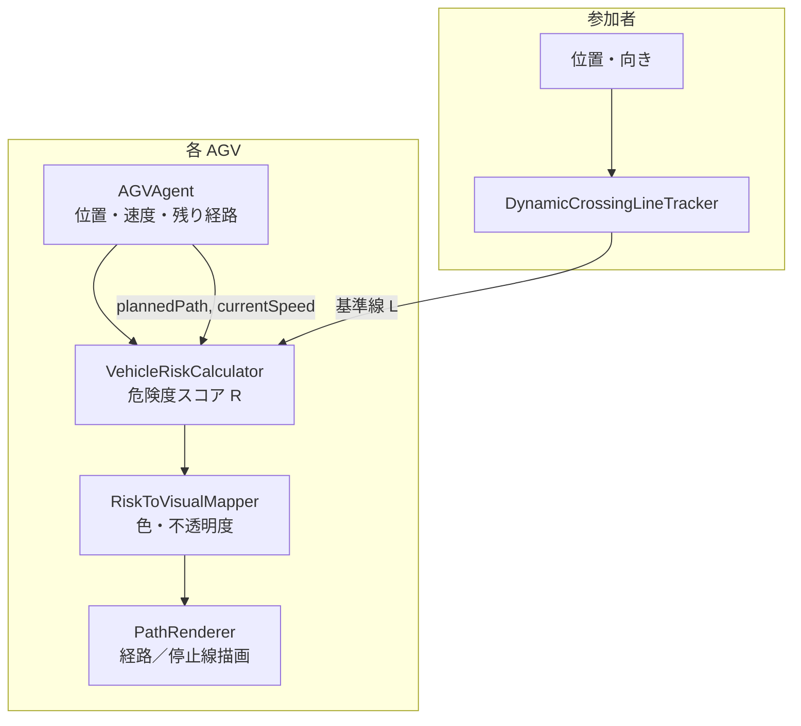
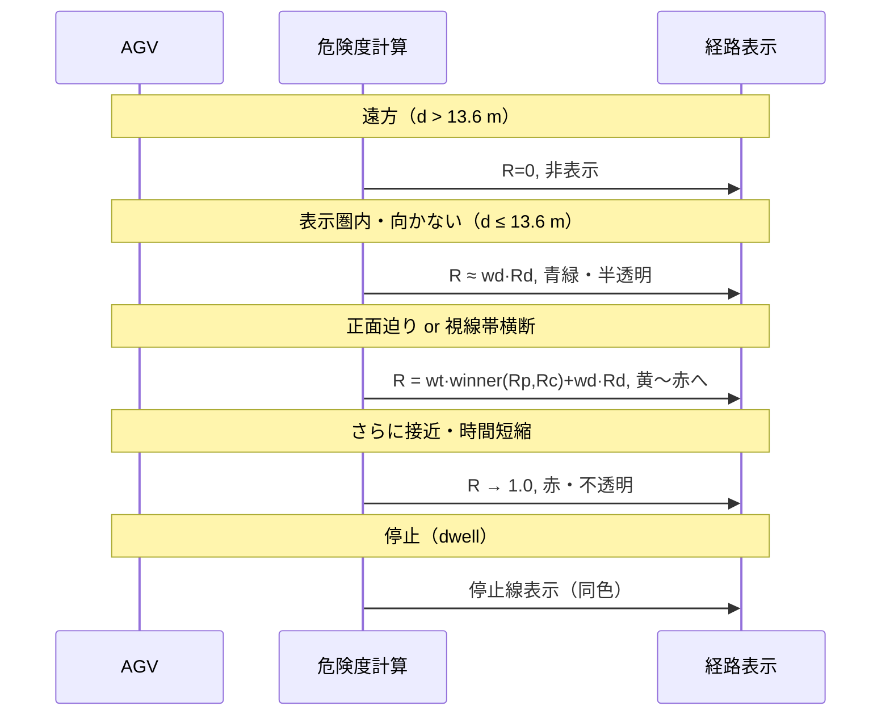

# 危険度連動 AGV 経路可視化 — 提案書類

本書は、工場内 AGV 実験における **Proposed 条件**（危険度連動 eHMI）の設計・計算方法を論文執筆用に整理したものである。実装は `VehicleRiskCalculator.cs`、`RiskToVisualMapper.cs`、`PathRenderer.cs`、`DynamicCrossingLineTracker.cs` に対応する。

---

## 1. 概要

### 1.1 目的

複数 AGV が走行する工場環境で、作業員（参加者）が Station A から Station B へ移動する際、各 AGV の **残り走行経路** を AR 風オーバーレイで表示する。Proposed 条件では、AGV と参加者の **相対的な危険度** に応じて経路表示の **色相・彩度・明度・不透明度** を連続的（色）かつ段階的（不透明度）に変化させ、危険が高い AGV の経路ほど目立たせる。

### 1.2 3 条件との関係

| 条件 | 危険度計算 | 色・不透明度 |
|------|-----------|-------------|
| **Baseline** | スキップ（常に最大危険度扱い） | 固定色・不透明度 1.0 |
| **No-AR** | — | 経路非表示 |
| **Proposed** | PTTC / path TTC の勝者 + 近接 | 危険度連動（本書の対象） |

---

## 2. システム構成

毎フレーム、各 AGV について以下を実行する。

1. 参加者の NavMesh 最短経路から **動的基準線** を更新
2. AGV の残り経路と基準線の交差から **TTC（Time To Conflict）** を計算
3. TTC と近接距離から **危険度スコア** $R \in [0, 1]$ を算出
4. $R$ を **HSV 色** と **連続不透明度** に変換
5. 走行中は残り経路、停止中は停止線として描画

---

## 3. 動的基準線（視線方向の太線）

目的地を仮定せず、参加者が **今見ている方向** に対して、棚などの障害物まで届く **太い直線ゾーン** を毎フレーム更新する。

### 3.1 視線方向

HMD／カメラ（`lookTransform`）の forward を XZ 平面に投影し、水平視線方向 $\mathbf{f}$ を得る。

$$
\mathbf{f} = \mathrm{normalize}\bigl((f_x,\, 0,\, f_z)\bigr)
$$

### 3.2 レイキャスト（障害物までの距離）

視線起点（目の高さ）$\mathbf{o}$ から $\mathbf{f}$ 方向へ Physics レイを飛ばし、最初に当たった障害物（棚・壁など）の hit 点 $\mathbf{h}$ を求める。参加者自身および AR 経路表示用レイヤーは無視する。当たりが無い場合は最大距離（40 m）まで延長する。

### 3.3 太い基準線の配置

床面上（参加者の Y）に軸を投影し、

$$
\mathbf{a}_\text{start} = \mathbf{p}, \quad \mathbf{a}_\text{end} = \mathrm{flatten}(\mathbf{h})
$$

とする。$\mathbf{p}$ は参加者位置。幅 $w =$ **0.5 m**（半幅、全幅 1.0 m）の帯状ゾーンとして、AGV 経路が **中心軸またはその平行オフセット $\pm w$** に交差するか、軸から $w$ 以内に近づくかを TTC 判定に用いる。

### 3.4 意義

基準線は「**参加者が今注目している方向に、AGV が割り込みうる範囲**」を表す。Station B への最短経路を仮定しないため、途中で立ち止まって別方向を見た場合も視線に追従する。

---

## 4. 危険度スコアの算出

各 AGV に `VehicleRiskCalculator` を付与し、スコア $R \in [0, 1]$ を毎フレーム更新する。$R$ が大きいほど危険（表示は赤・不透明に近づく）。

### 4.1 表示可否（Visibility）

経路を描画するかどうかは **水平距離のみ** で判定する（$T_\text{max}$ はスコア正規化専用）。

$$
\text{visible} = (d \le D_\text{max})
$$

| 記号 | 意味 | 値 |
|------|------|-----|
| $d$ | AGV と参加者の **水平**（XZ）距離 | m |
| $D_\text{max}$ | 表示・近接スコア上限 | **13.6 m**（$(2.0 + 1.4) \times 4$） |
| $T_\text{max}$ | 時間スコアの正規化上限 | **4.0 s**（表示ゲートには使わない） |

$$
D_\text{max} = (v_\text{AGV,max} + v_\text{ped}) \times T_\text{max}
$$

$v_\text{AGV,max}=2.0$ m/s（`AGVSpawner.maxSpeed`）、$v_\text{ped}=1.4$ m/s（`PlayerLocomotion`）、$T_\text{max}=4$ s。

$\text{visible} = \text{false}$ のとき $R = 0$ とし、経路は非表示とする（Proposed 条件）。

### 4.2 三つの危険要因

**PTTC（人への閉じ込み）** $T_p$：相対位置 $\mathbf{r}$（水平）と相対速度 $\mathbf{v}_\text{rel}=\mathbf{v}_\text{AGV}-\mathbf{v}_\text{ped}$ から

$$
v_\text{close} = \max(0,\, \hat{\mathbf{r}}\cdot\mathbf{v}_\text{rel}), \quad
T_p =
\begin{cases}
\infty & v_\text{close} \approx 0 \\
d / v_\text{close} & \text{それ以外}
\end{cases}
$$

**経路 TTC（視線基準線）** $T_c$：残り計画経路上を速度 $v$ で進んだとき、太線ゾーンとの最初の交差までの時間

$$
T_c = \frac{s}{\max(v,\, 0.1)}, \quad\text{交差なしまたは }T_c > T_\text{max}\text{ なら }\infty
$$

**近接距離** $d$：上記の水平距離。

### 4.3 各要因のスコア化

$\gamma = 0.6$。時間・距離とも同じ冪乗形に揃える。

$$
f(T) =
\begin{cases}
0 & T=\infty \text{ または } T > T_\text{max} \\[2pt]
(1 - T/T_\text{max})^{\gamma} & 0 \le T \le T_\text{max}
\end{cases}
\quad
R_p = f(T_p),\; R_c = f(T_c)
$$

$$
R_d =
\begin{cases}
0 & d \ge D_\text{max} \\[2pt]
(1 - d/D_\text{max})^{\gamma} & d < D_\text{max}
\end{cases}
$$

### 4.4 統合スコア（時間系の勝者 + 近接）

$$
R_{\mathrm{time}} =
\begin{cases}
R_p & 2 R_p \ge R_c \\
R_c & \text{otherwise}
\end{cases}
\qquad
R = w_t R_{\mathrm{time}} + w_d R_d
$$

| 記号 | 初期値 | 役割 |
|------|--------|------|
| $w_t$ | **0.85** | 時間系（PTTC または path TTC）の勝者 |
| $w_d$ | **0.15** | 近接は保険（主役にしない） |
| 比較係数 | **2** | 判定のみ。$2 R_p \ge R_c$ なら $R_p$ を採用（スコア本体には掛けない） |

PTTC と path TTC は同時に最大になりにくいため和ではなく max 選択とする。係数 2 は人への迫りをやや優先する閾値。不透明度の下限は `RiskToVisualMapper` の $\alpha_{\min}=0.35$ で担保する（$R_\text{floor}$ は用いない）。

---

## 5. 色・不透明度への変換

危険度スコア $R$ を `RiskToVisualMapper` で視覚属性に写像する。**Proposed 条件のみ** 本マッピングを適用する。

### 5.1 色相（Hue）— 連続変化

HSV 色空間を用い、**危険（赤）から安全（青緑）** へ線形補間する。

$$
H(R) = \mathrm{lerp}(180°,\, 0°,\, R) = (1 - R) \times 180°
$$

| $R$ | 色相 $H$ | 見え方 |
|-----|---------|--------|
| 0.0 | 180° | 青緑（安全側） |
| 0.5 | 90° | 黄緑 |
| 1.0 | 0° | 赤（危険側） |

### 5.2 彩度（Saturation）— 連続変化

$$
S(R) = 0.4 + 0.6R
$$

$R$ が高いほど鮮やか（$S$: $0.4 \to 1.0$）。

### 5.3 明度（Value）— 連続変化

$$
V(R) = 0.5 + 0.3R
$$

$R$ が高いほど明るい（$V$: $0.5 \to 0.8$）。

### 5.4 RGB への変換

$$
(RGB) = \mathrm{HSVtoRGB}\bigl(H(R)/360,\; S(R),\; V(R)\bigr)
$$

**「だんだん色が変わる」** 仕組みの核心は、$R$ が時間とともに連続的に変化し、それに連動して **$H$, $S$, $V$ がすべて滑らかに補間される** 点にある。AGV が参加者に近づいたり、交差時刻が近づいたりすると $R \uparrow$ → 青緑 → 黄 → 赤へと移行する。

### 5.5 不透明度（Alpha）— 連続変化

色と同様に、不透明度も $R$ に対して **連続補間** する。

$$
\alpha(R) = 0.35 + 0.65R
$$

危険度が低いうちは半透明（$\alpha \approx 0.35$）、高くなるほど不透明（$\alpha \to 1.0$）になり、視覚的サリエンスが滑らかに増す。

---

## 6. 経路の描画

`PathRenderer` が最終的な表示を担当する。

### 6.1 表示距離ゲート

プレイヤー（カメラ）から AGV までの **水平距離** が **13.6 m 以内** の AGV のみ描画する。危険度計算の $D_\text{max}$ と一致する。

$$
D_\text{max} = (v_\text{AGV,max} + v_\text{ped}) \times T_\text{max} = (2.0 + 1.4) \times 4 = 13.6 \;\text{m}
$$

$v_\text{AGV,max}$: AGV 最大速度 2.0 m/s、$v_\text{ped}$: 参加者歩行速度 1.4 m/s、$T_\text{max}$: TTC 上限 4 s。

### 6.2 走行中

- **形状**: 残り計画経路全体を LineRenderer で描画
- **テーパー**: 根元幅 **0.65 m** → 先端幅 **0.12 m**（三角形状の先端表現）
- **高さ**: 床面上 **0.22 m** に持ち上げ
- **色**: 第 5 節で求めた $(RGB, \alpha)$ を経路全体に均一適用

### 6.3 停止中

AGV がピックアップ／ドロップの dwell フェーズ（`IsStopped = true`）のとき:

- 残り経路の描画を止め、**停止線** を表示
- 停止位置（経路先端）に垂直な線分、全幅 **1.0 m**（半幅 0.5 m）
- 線幅 **0.18 m**、色・不透明度は走行時と同じ $R$ 連動

### 6.4 描画優先度

`sortingOrder = round(R × 100)` により、危険度の高い AGV の経路が手前に描画される。

---

## 7. 時間発展 — 色が変わる典型シナリオ

---

## 8. パラメータ一覧

| パラメータ | 記号 | 値 | 根拠・備考 |
|-----------|------|-----|-----------|
| 時間正規化上限 | $T_\text{max}$ | 4.0 s | $R_p$, $R_c$ の正規化（表示ゲートには使わない） |
| 表示・近接上限 | $D_\text{max}$ | 13.6 m | $(v_\text{AGV,max}+v_\text{ped}) \times T_\text{max}$。表示はこれのみ |
| 融合 | $w_t,w_d$・比較 | 0.85, 0.15・×2 判定 | 時間系の勝者 + 近接。$2R_p$ は比較のみ |
| 非線形係数 | $\gamma$ | 0.6 | 危険度カーブの急峻さ |
| 基準線半幅 | $w$ | 0.5 m | 視線方向太線の半幅（全幅 1.0 m） |
| 視線レイ最大距離 | — | 40 m | 障害物未命中時の延長 |
| 不透明度 | $\alpha$ | $0.35 + 0.65R$ | 連続補間 |
| 色相範囲 | $H$ | 180° → 0° | 青緑（安全）→ 赤（危険） |
| 経路根元幅 | — | 0.65 m | 走行経路テーパー |
| 経路先端幅 | — | 0.12 m | 走行経路テーパー |
| 停止線全幅 | — | 1.0 m | 停止時の横線 |

---

## 9. 論文記述用 — 数式まとめ

**危険度スコア**

$$
R = w_t R_{\mathrm{time}} + w_d R_d,\quad
R_{\mathrm{time}} =
\begin{cases}
R_p & 2 R_p \ge R_c \\
R_c & \text{otherwise}
\end{cases}
$$

（表示: $d\le D_\text{max}$ のみ。$R_p=f(T_p)$, $R_c=f(T_c)$, $R_d=(1-d/D_\text{max})^{\gamma}$）

**色マッピング**

$$
\text{Color}(R) = \mathrm{HSV}\!\left(
\underbrace{(1-R) \times 180°}_{H},\;
\underbrace{0.4 + 0.6R}_{S},\;
\underbrace{0.5 + 0.3R}_{V}
\right)
$$

**不透明度**

$$
\alpha(R) = 0.35 + 0.65R
$$

---

## 10. Baseline / No-AR との対照（Methods 節向け）

| 項目 | Baseline | No-AR | Proposed |
|------|----------|-------|----------|
| 経路表示 | あり | なし | あり |
| 危険度計算 | なし（$R=1$ 固定） | — | PTTC / path TTC の勝者 + 近接 |
| 色 | 固定 `(R,G,B) = (0.25, 0.55, 1.0)` | — | $H,S,V$ 連動 |
| 不透明度 | 1.0 固定 | — | 連続（$0.35$–$1.0$） |
| 表示距離 | 13.6 m 以内 | — | 13.6 m 以内 |

Baseline は「常に同じ見た目の AR 経路提示」、Proposed は「危険度に応じた動的エンコーディング」、No-AR は「経路情報なし」として、被験者内比較の 3 水準を構成する。

---

## 11. 設計上の注意点（Discussion 向け）

1. **基準線の視線追従**: 目的地を仮定せず、見ている方向へレイを飛ばした太線ゾーンで AGV 交差を評価する。
2. **表示は距離のみ、スコアは時間系の勝者 + 近接**: 出す／出さないは $d\le D_\text{max}$。$2 R_p$ は判定のみで PTTC をやや優先し、勝ち側に $w_t=0.85$、近接に $w_d=0.15$。
3. **色・不透明度はともに連続**: 色相と不透明度が $R$ に連動して滑らかに変化し、「だんだん危険」を段階の飛びなく伝える。
4. **2D 交差判定**: 経路 TTC 計算は XZ 平面の線分交差。高さ方向の差は直接入らない（床面走行 AGV の簡略化）。
5. **表示距離 13.6 m**: $D_\text{max} = (v_\text{AGV,max} + v_\text{ped}) \times T_\text{max}$。描画ゲートと $R_d$ 正規化の両方に使用。

---

## 12. 実装対応表

| 論文概念 | 実装クラス | 主要メンバ |
|---------|-----------|-----------|
| 動的基準線 | `DynamicCrossingLineTracker` | `AxisStart`, `AxisEnd`, `LineHalfWidth` |
| 危険度スコア | `VehicleRiskCalculator` | `currentScore`, `isVisible` |
| 色・不透明度 | `RiskToVisualMapper` | `Map(R)` |
| 経路描画 | `PathRenderer` | `LineRenderer`, `stopLineRenderer` |
| 条件切替 | `AGVPathVisualizer` | `VisMode.Baseline / NoAR / Proposed` |

---

## 変更履歴

| 日付 | 内容 |
|------|------|
| 2026-08-20 | 初版作成（実装ベース） |
| 2026-08-20 | 基準線を視線方向レイ＋太線ゾーン方式に変更（NavMesh 最短経路は不使用） |
| 2026-08-20 | 近接表示上限を $(2.0+1.4)\times4=13.6$ m に変更 |
| 2026-08-20 | 数式を `$...$` / `$$...$$` 形式に統一 |
| 2026-09-06 | 危険度を PTTC+path TTC+近接の重み付き和に変更。表示ゲートは $d\le D_\text{max}$ のみ |
| 2026-09-07 | 統合を $R=0.85\cdot R_{\mathrm{time}}+0.15 R_d$（$R_{\mathrm{time}}$ は $2R_p$ 判定で Rp/Rc の勝者）に変更。$R_\text{floor}$ 廃止 |
| 2026-09-07 | PTTC を相対速度 $\mathbf{v}_\text{AGV}-\mathbf{v}_\text{ped}$ に変更 |
